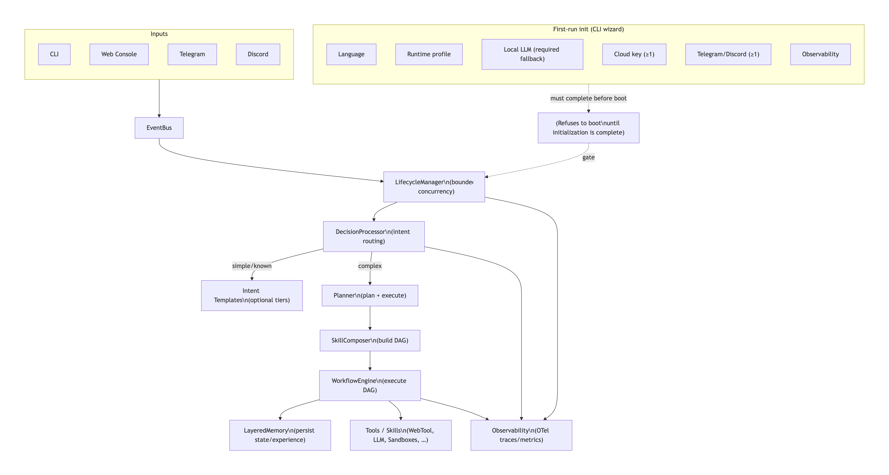

<p align="center">
  
</p>

<p align="center">
  <strong>AdamI: Human + AI Unified, Self-Evolving Agent Collaboration Engine</strong>
</p>

> 中文版：`README.zh-Hans.md`

## Why AdamI (Pain Points)

Many multi-agent systems can run demos, but struggle to scale into reliable, reusable production
systems. AdamI focuses on:

- **Collaboration drift**: unclear boundaries and scattered state across agents/tools; hard retries and rollback.
- **Poor workflow reusability**: one-off prompts/scripts don’t become versioned, auditable, evolvable units (skills/workflows).
- **Local + cloud complexity**: mixing local LLMs, remote LLMs, web tools, and channels (Telegram/Discord/CLI/Web) is hard to unify.
- **Production observability gaps**: inconsistent metrics/traces/log policies make SLOs, failure-rate governance, audits, and redaction harder.

## Key Features

- **[Evolve] Self-evolving skill loop**: learn from execution/replay to evolve skills and workflows.
- **[Workflow] Recoverable workflows**: DAG-based orchestration with pause/resume/audit and persisted state.
- **[Local LLM] Local LLM support**: local inference with safe fallback behavior, plus optional cloud acceleration.
- **[Multi-Channel] Multi-channel UX**: one execution path across CLI / Web / Telegram / Discord.
- **[Obs] Production observability**: OpenTelemetry traces + metrics with explicit sampling and export redaction policies.

## Quick Start (<= 3 steps)

Goal: run a local interactive demo (CLI) in 3 steps.

```bash
# 1) Install dependencies
poetry install

# 2) Start AdamI (CLI demo)
poetry run adami

# 3) Type tasks in the CLI (e.g. help / report / intake)
```

### First-run required setup (industrial strict)

On the first run, AdamI will **refuse to boot** until you complete the CLI initializer (language →
runtime profile → local LLM (required fallback) → cloud keys (at least one required) → Telegram/Discord (at least one required) →
observability).

The wizard writes to a local override file (loaded after `.env`):

- default: `.adami_data/cli_overrides.env`
- override path: set `ADAMI_CLI_ENV_FILE=/path/to/cli_overrides.env`

To re-run onboarding, delete the overrides file (or set `ADAMI_FIRST_RUN_COMPLETE=false` inside it),
then run `poetry run adami` again.

#### Adjust timeouts (recommended)

If you run long tasks through CLI / Telegram / Discord, set hard timeouts to prevent a stuck task
from blocking the per-chat FIFO queue:

- `ADAMI_CLI_TASK_HARD_TIMEOUT_SEC` (default 900s)
- `ADAMI_TASK_HARD_TIMEOUT_SEC` (default 900s)

You can change these in the CLI **System settings** menu (it writes to `.adami_data/cli_overrides.env`)
or by exporting the variables in your environment.

#### DLQ (Dead Letter Queue) operations (recommended)

The EventBus uses a SQLite-backed DLQ to avoid losing events under transient load. If you upgraded from
older versions and see **RBAC/DLQ log spam**, you can clear the DLQ once on boot:

- `ADAMI_DLQ_CLEAR_ON_BOOT=1`

Manual DLQ cleanup (repo root, default path):

```bash
rm -f .adami_data/dlq.db .adami_data/dlq.db-wal .adami_data/dlq.db-shm
```

## Architecture (Multi-Agent Orchestration)

```mermaid
flowchart TB
  subgraph Inputs[Inputs]
    CLI[CLI]
    WEB[Web Console]
    TG[Telegram]
    DC[Discord]
  end

  Inputs --> EB[EventBus]
  EB --> LM[LifecycleManager\n(bounded concurrency)]
  LM --> DP[DecisionProcessor\n(intent routing)]
  DP -->|simple/known| Templates[Intent Templates\n(optional tiers)]
  DP -->|complex| Planner[Planner\n(plan + execute)]
  Planner --> Composer[SkillComposer\n(build DAG)]
  Composer --> Engine[WorkflowEngine\n(execute DAG)]
  Engine --> Memory[LayeredMemory\n(persist state/experience)]
  Engine --> Tools[Tools / Skills\n(WebTool, LLM, Sandboxes, ...)]

  Engine --> Obs[Observability\n(OTel traces/metrics)]
  DP --> Obs
  LM --> Obs
```

## Enterprise / Cloud

If you need a more complete enterprise offering (governance, audits/compliance, centralized
observability, multi-tenant collaboration, managed service and SLAs), contact us:

- **Enterprise**: on-prem deployment / custom integrations / compliance support
- **Cloud**: managed AdamI (SaaS)

Contact entry: configure your licensing / booking contact in `COMMERCIAL_LICENSE.md`.

Packaging overview (OSS vs Enterprise/Cloud): `ENTERPRISE_FEATURE_MATRIX.md`.

### Private deployment resources

- **Local model integration (private deployment guide)**: `docs/deployment/private_local_llm_deployment_guide.en.md` (中文：`docs/deployment/private_local_llm_deployment_guide.md`)
- **Example workflow repository (value templates)**: `adami-awesome-workflows/`

## Releases

Please use **GitHub Releases** for official versions (avoid relying on `main`).

- Changelog: `CHANGELOG.md`
- Current milestone: **v1.0.0-alpha** (planned)

## Overview

`adami-kernel` is an industrial microkernel for a distributed “digital organism”.
It runs as an event-driven system with a unified workflow execution path:

- **CLI/Web/Neural inputs** publish events to the **EventBus**
- **LifecycleManager** consumes `system.events` with bounded concurrency
- **DecisionProcessor** routes intents and delegates complex tasks to the **Planner**; on `COMPLEX_TASK`, enabling **`ADAMI_INTENT_ADAPTIVE_PIPELINE_ENABLED`** runs the optional tiered intent path (rules → optional LLM → `intent_template_registry`) first, then falls back to the Planner when no template wins (default **off** preserves legacy behaviour)
- **SkillComposer** builds a `WorkflowState` DAG for composed tasks (including skill creation)
- **WorkflowEngine** executes DAGs (pause/resume/audit via persisted state)
- **LayeredMemory** persists workflow states and experiences (`.adami_data/l2_memory.db`)

## License

This project is **dual-licensed**:

- **AGPL-3.0-or-later** (default open-source license): see `LICENSE-AGPL-3.0.txt`
- **Commercial license** (for proprietary / closed-source usage): see `COMMERCIAL_LICENSE.md`

### Intent adaptive pipeline (Steps 1–6)

Tiered intent classification (families → types → `template` | `dynamic` | `clarify`)
targets unpredictable `COMPLEX_TASK` rows before the Planner. **Step 1** adds shared contracts
under `src/adami_kernel/cortex/intent_adaptive/`; **Step 2** adds **`TemplateRegistry`** /
**`IntentTemplateHandler`** (`TemplateExecutionContext`, `TemplateOutcome`, `NoOpTemplateHandler`).
**Phase 1 (Step 3)** adds **`rule_classify_after_router`** (rule-only, `COMPLEX_TASK` only, never
overrides `SYSTEM_ACTION` / `DIRECT_ANSWER`). **Step 4** adds optional **`maybe_llm_classify_with_settings`**
behind **`ADAMI_INTENT_LLM_CLASSIFIER_ENABLED`** (default **`false`**). **Step 4.1** adds multi-label
merge (`families`, **`ADAMI_INTENT_ACTION_PERMISSION_GRANTED`**). **Step 5** wires
**`_maybe_route_intent_adaptive`** into **`DecisionProcessor._dispatch_complex_task`** before
**`TaskPlanner`**, gated by **`ADAMI_INTENT_ADAPTIVE_PIPELINE_ENABLED`** (default **`false`**); optional
one-line degrade notice: **`ADAMI_INTENT_ADAPTIVE_FALLBACK_NOTICE`** + **`intent.adaptive.user.fallback_to_planner`**.
Clarify path uses **`intent.clarify.prompt`**. Registry instance: **`intent_template_registry`** (built in
`ComponentInitializer`). **Step 6** registers thin preset handlers under
`cortex/intent_adaptive/templates/` and **`bootstrap_templates.register_builtin_intent_templates`**
(weather + crypto: `WebTool.search` first, then optional `call_llm`, else i18n stub — no subprocess in templates).
**Step 7** passes optional **`intent_adaptive_meta`** (English keys: `handoff_kind`, `handoff_reason`, `route`, `primary_family`, …) into **`TaskPlanner.plan_and_execute`** when the adaptive tier runs but does not fully handle the utterance (same Planner/workflow behaviour as before; meta is for DEBUG telemetry — see **`docs/intent_adaptive_pipeline.md`** § Step 7).
**Step 7.1** consumes that meta in the Planner: an English one-line **`Prior intent guess:`** summary is injected into the legacy JSON plan prompt, the Anthropic workflow-skill wrapper, and the MCP-Agent pilot preamble (`doc.intent_adaptive.planner_hook`).
**Step 8.1** wires ACTION-family intent templates to **HITL-style Telegram ack**: `HitlHandler` stores a one-shot per-chat ack from `intent_action_tpl:…` callbacks; `DecisionProcessor` consumes it so **no template `execute` runs without confirmation** (CLI/discord use `intent.action_template.hitl_fallback_body`). See **`doc.intent_adaptive.step81_hitl_action`**.
**Step 8** adds production guards: **`ADAMI_INTENT_ADAPTIVE_LLM_PHASE_TIMEOUT_SEC`** (outer cap on the LLM classify phase), **`ADAMI_INTENT_TEMPLATE_EXECUTE_TIMEOUT_SEC`** (per preset `execute`), and **`ADAMI_INTENT_ACTION_TEMPLATE_REQUIRES_CONFIRMATION`** so **ACTION**-family templates need **`ADAMI_INTENT_ACTION_PERMISSION_GRANTED`** or **`router_data.intent_action_user_ack`** before auto-run. User copy: **`intent.action_template.confirm_required`**, **`intent.adaptive.template_execute_timeout`**. See **`doc.intent_adaptive.step8_guards`** and `.env.example` (English comments).

**Production safety profile (Docker sandbox):** **`ADAMI_RUNTIME_PROFILE`** defaults from context — unset means **auto**: **`production`** when `/.dockerenv` exists (kernel running in a container), otherwise **`development`**. **`production`** applies **`ADAMI_SKIP_DOCKER_SANDBOX=false`**, **`DEBUG=false`**, read-only container root + **`cap_drop=ALL`** for DreamSandbox (`ADAMI_DOCKER_SANDBOX_*` in `config.py`), unless those variables are explicitly exported. Operators on bare metal can set **`ADAMI_RUNTIME_PROFILE=production`** to match container defaults; see `.env.example`.

**Built-in template `IntentType` wire ids (today)**  
`retrieval.weather` · `retrieval.crypto`  
(Other `IntentType` constants in `models.py` may still route to Planner until a template is added.)

Design notes: **[docs/intent_adaptive_pipeline.md](docs/intent_adaptive_pipeline.md)** (§ Step 9: CI / offline matrix; § Step 10: cleanup, no demo echo in bootstrap, release narrative).

### Reviewer verification — intent adaptive pipeline (Step 9)

Copy into the PR when touching `cortex/intent_adaptive`, `DecisionProcessor` intent routing, HITL/Telegram ACTION ack, or related i18n.

1. `poetry install`
2. `PYTEST_DISABLE_PLUGIN_AUTOLOAD=1 poetry run pytest tests/test_intent_adaptive_* tests/test_i18n_locale_key_parity.py -q`
3. (Optional) `PYTEST_DISABLE_PLUGIN_AUTOLOAD=1 poetry run pytest tests/test_decision_processor_intent_adaptive_smoke.py -q`
4. (Optional) `PYTEST_DISABLE_PLUGIN_AUTOLOAD=1 poetry run pytest tests/test_planner_intent_adaptive_meta_step71.py -q` — rows that need SQLite may `pytest.importorskip("aiosqlite")` when the dependency is missing
5. Confirm CI job **`compliance-and-test`** is green on the PR (includes the **Intent adaptive — offline test matrix (Step 9)** step and the full `pytest -m "not integration and not stress"` gate)

### Release notes (CHANGELOG + PR narrative)

This repository **does** ship a root-level `CHANGELOG.md`, and official versions are published via
**GitHub Releases**.

For complex areas (especially **intent adaptive** and the **document pipeline**), please also use
the relevant docs as your detailed change narrative source of truth and copy key operator-facing
bullets into the PR description when behaviour, defaults, or safety gates change:

- **Intent adaptive**: [docs/intent_adaptive_pipeline.md](docs/intent_adaptive_pipeline.md) (see § Step 10)
- **Document pipeline**: [docs/document_parsing_baseline_step0.md](docs/document_parsing_baseline_step0.md) (see Step 8)

i18n (non-exhaustive key ids): **`doc.intent_adaptive.overview`**, **`doc.intent_adaptive.step1_models`**,
**`doc.intent_adaptive.step2_template_registry`**, **`doc.intent_adaptive.rule_tier`**,
**`doc.intent_adaptive.step4_llm_classifier`**, **`doc.intent_adaptive.step41_merge`**, **`doc.intent_adaptive.step5_decision_wiring`**,
**`doc.intent_adaptive.step6_templates`**, **`doc.intent_adaptive.step51_observability`**, **`doc.intent_adaptive.planner_hook`**, **`doc.intent_adaptive.step8_guards`**, **`doc.intent_adaptive.step81_hitl_action`**, **`doc.intent_adaptive.ci`**, **`doc.operator.intent_adaptive_grep`**,
**`intent.template.no_match`**, **`intent.classifier.parse_error`**, **`intent.classifier.unavailable`**,
**`intent.clarify.prompt`**, **`intent.adaptive.user.fallback_to_planner`**,
**`intent.help.body`**, **`intent.help.supported_types`**, **`intent.template.weather_title`**, **`intent.template.weather_stub`**, **`intent.template.crypto_title`**, **`intent.template.crypto_stub`**
and task-queue UI keys (`dp.session.busy_queued`, `dp.task.hard_timeout_released`, `shell.queue.*`, `port.queue.*`, `port.menu.restart_pending_*`)
in `src/adami_kernel/i18n/locales/*/common.json`.

## Repository structure (high level)

- `src/adami_kernel/`: Python kernel package (runtime, orchestration, memory, skills, web)
- `frontend/`: Web Console (React + Vite)
- `skills/`: skill sources/examples (not the runtime-generated skills directory)
- `tests/`: test suite
- `scripts/`: operational helpers (e.g. experience/policy rsync)
- `docs/`: operational and design notes
- `.adami_data/`: runtime data (logs, memory DB, generated skills) — excluded from docs generation

### Skill module & policy loader

- **End-to-end skill pipeline** (every module under `src/adami_kernel/skill_manager/`, plus factory → builder → validator → inspector → evolution → `SkillManager`, optional vector index) is summarized under i18n key **`doc.skill.pipeline`** (`src/adami_kernel/i18n/locales/*/common.json`) and detailed in **[docs/skill_module_acceptance_audit_2026_04.md](docs/skill_module_acceptance_audit_2026_04.md)** (includes a full file-level inventory table).
- **Boot-time skill counts** for the Web console are synchronized by **`adami_kernel.nexus.skill_loader.SkillLoader`**, which reads **Evolution in-memory** skills. It is **not** the same class as `adami_kernel.skill_manager.skill_loader.SkillLoader` (legacy / optional file-loader implementation; see its module docstring).
- **Policy manifest polling:** `PolicyLoader` uses **`ADAMI_POLICY_RELOAD_INTERVAL_SEC`** (default **60**). Polling on an unchanged `manifest.json` is normal; **INFO “hot reload” lines every minute for the same file are not**—that behavior was fixed so only real manifest changes log at INFO (see the audit doc).

## Key entrypoints

- **Kernel main**: `src/adami_kernel/kernel.py` (Poetry script: `adami`)
- **Interactive CLI**: `src/adami_kernel/nexus/shell.py`
- **Workflow execution**: `src/adami_kernel/orchestrator/workflow_engine.py`
- **Planner**: `src/adami_kernel/orchestrator/planner.py`
- **Web Console**: `src/adami_kernel/web/app.py` (started via `core/boot_manager.py`)

## Task queue (CLI / Telegram / Discord)

AdamI maintains a **per-chat task queue** so that when a previous request is still running,
new requests are **queued (FIFO)** instead of being dropped. The queue is persisted under:

- `.adami_data/task_queue.json` by default, or override with `ADAMI_TASK_QUEUE_PATH` (see `config.py`).

Behavior:

- **Busy → enqueue**: when you submit a new task while the session is busy, AdamI replies with
  `dp.session.busy_queued` (includes queue position / total) and enqueues the request (unless
  `ADAMI_TASK_QUEUE_OVERFLOW_MODE=reject` and caps are hit, in which case users see `dp.session.queue_capped`).
- **TTL / caps / encryption**: pending rows honor `ADAMI_TASK_QUEUE_TTL_SEC`, per-chat and global
  `ADAMI_TASK_QUEUE_MAX_*`, and optional at-rest Fernet wrapping via `ADAMI_TASK_QUEUE_FERNET_KEY`.
  Operational backup tiering: [docs/ops_data_classification_backup.md](docs/ops_data_classification_backup.md).
- **Auto-drain**: when a running task completes and releases the session lock, the next queued task
  is automatically dispatched.
- **Restart / exit safety**:
  - **CLI**: exiting/restarting prompts if there are unfinished tasks.
  - **Telegram / Discord**: menu-triggered restart is gated; if there are unfinished tasks, you must
    confirm restart. On reboot, AdamI proactively notifies the same chat with pending tasks and
    provides **Continue / Discard** buttons.
- **Hard timeout (CLI)**: to prevent a stuck task from holding the session lock forever, CLI tasks
  are wrapped in a hard timeout (`ADAMI_CLI_TASK_HARD_TIMEOUT_SEC`, default 600s). On timeout AdamI
  releases the session and continues draining the queue (`dp.task.hard_timeout_released`).

Messenger routing defaults are **not** shipped in-repo: if `TELEGRAM_BOT_TOKEN` is set, you must also
set `TELEGRAM_CHAT_ID`; if `DISCORD_BOT_TOKEN` is set, you must set at least one of
`DISCORD_DEFAULT_USER_ID` / `DISCORD_DEFAULT_CHANNEL_ID` / `DISCORD_DEFAULT_GUILD_ID` (numeric snowflakes).
Otherwise kernel startup fails fast when registering Telegram/Discord nerves (see `.env.example`).

## Quickstart

### Python (kernel)

This project is managed with Poetry.

```bash
poetry install
poetry run adami
```

If you prefer `pip` (less reproducible than Poetry), you can install from `requirements.txt`:

```bash
python -m venv .venv
source .venv/bin/activate
pip install -U pip
pip install -r requirements.txt
```

Dev tools (tests / lint):

```bash
pip install -r requirements-dev.txt
```

Optional **document → Markdown** (Microsoft MarkItDown, formats: pdf, docx, pptx, xlsx; pinned `~0.1.x` per upstream 0.1 API notes):

```bash
poetry install -E markitdown
```

Default `poetry install` does **not** install MarkItDown. See [docs/document_parsing_baseline_step0.md](docs/document_parsing_baseline_step0.md) (Step 1) and i18n key `doc.pipeline.step1` in `locales/*/common.json`.

**Step 2 (kernel API)**: after `poetry install -E markitdown`, use `adami_kernel.cortex.document_markdown` (`document_markdown.py`) — async `convert_document_path_to_markdown` / `convert_document_stream_to_markdown` (MarkItDown with `enable_plugins=False`, whitelisted pdf/docx/pptx/xlsx, char budget aligned with document LLM excerpts). UI hint: `doc.pipeline.step2`.

**Step 3 (multimodal wiring)**: `MultiModalInput._process_file` tries that Markdown path first for the same four suffixes, then falls back to optional `unstructured.partition`; see [docs/document_parsing_baseline_step0.md](docs/document_parsing_baseline_step0.md) (Step 3). UI hint: `doc.pipeline.step3`.

**Step 4 (intake / SecondBrain)**: `/intake` and `INTAKE_AUTO` route before `PARSE_DOCUMENT`; when the event includes `file_path`, `_handle_intake_action` reuses `toolbox.multi_modal` and archives Markdown (`raw_content`) into Inbox with optional YAML `source_file` / `body_format: markdown`. See the same doc (Step 4). UI hint: `doc.pipeline.step4`.

**Step 5 (skills docs / SSOT)**: repository skills (e.g. `skills/skills/pptx/`) instruct authors to use the **kernel** for document→Markdown (`adami_kernel.cortex.document_markdown`, `convert_document_path_to_markdown`) instead of installing MarkItDown or the `python -m markitdown` CLI in skill sandboxes; optional CLI is **dev-only** where documented. UI hint: `doc.pipeline.step5`.

**Step 6 (config / observability)**: `Settings` in `config.py` — `ADAMI_MARKITDOWN_ENABLED` (`True` = default: always try the MarkItDown path first for whitelisted suffixes, then `not_installed` / unstructured as today; `None` = auto only if `markitdown` is importable; `False` = skip MarkItDown without uninstalling), `ADAMI_DOCUMENT_MARKDOWN_TIMEOUT_SEC` (MarkItDown convert and unstructured `partition` on the same file path), `ADAMI_DOCUMENT_MARKDOWN_MAX_INPUT_BYTES` (path inputs rejected before conversion). Operational logs use logger **`AdamI-DocumentParse`** with English markers `[doc.parse] route=…` (`markitdown_ok`, `markitdown_skipped`, `unstructured_ok`, `fallback_to_unstructured`, etc.). Defaults are class fields (not secrets — avoid putting these in `.env` unless you intentionally override). UI hint: `doc.pipeline.step6`.

**Step 7 (test matrix / CI)**: `tests/test_markitdown_bridge.py` — mocked MarkItDown failures assert fallback through a **stub `unstructured.partition`** (no `unstructured` pip in the default job); **one real `.docx`** round-trip when `poetry install -E markitdown` is present (`pytest.importorskip("markitdown")` otherwise skips that row). CI: job **`markitdown-bridge`** runs `poetry install -E markitdown` + that file only (see `ci.yml` / `.github/workflows/kernel-ci.yml`). PR checklist bullets: [docs/document_parsing_baseline_step0.md](docs/document_parsing_baseline_step0.md) (Step 7). UI hint: `doc.pipeline.step7`.

**Step 8 (release & migration notes)**: update `CHANGELOG.md` and use GitHub Releases for official versions; use the section **Optional capabilities — document pipeline** below and [docs/document_parsing_baseline_step0.md](docs/document_parsing_baseline_step0.md) (Step 8) for install defaults, Markdown-first behavior, rollback, and skills guidance. Copy the same bullets into the PR description when touching this area. UI hint: `doc.pipeline.step8`.

Logs are written to:

- `.adami_data/kernel.log`

Persistent memory is stored in:

- `.adami_data/l2_memory.db`

### Frontend (Web Console)

```bash
cd frontend
npm install
npm run dev
```

## Optional capabilities — document pipeline (Step 8)

Release-style notes for operators and reviewers (keep `CHANGELOG.md` updated for user-facing changes).

### Optional extra

- **`markitdown`**: `poetry install -E markitdown` (see `pyproject.toml` extras). Default `poetry install` does **not** add it.

### Default behavior vs Markdown-first

- **Extra not installed** (`ADAMI_MARKITDOWN_ENABLED` default **`True`**): the MarkItDown path still runs first and returns **`not_installed`** when the extra is absent; `MultiModalInput` then falls through to **`unstructured.partition`** when that stack exists on the host, otherwise the existing “no extractors” user copy. Set **`None`** for previous auto behavior (skip the MarkItDown attempt unless `markitdown` is importable).
- **Extra installed**: **Markdown-first** for `.pdf` / `.docx` / `.pptx` / `.xlsx` via `adami_kernel.cortex.document_markdown`, then unstructured fallback on failure. Intake with `file_path` follows the same path and prefers Markdown in SecondBrain when available.

### Rollback / troubleshooting

- **Disable MarkItDown without uninstalling**: set **`ADAMI_MARKITDOWN_ENABLED=False`** (class default in `config.py` or environment override via pydantic-settings). Tune **`ADAMI_DOCUMENT_MARKDOWN_TIMEOUT_SEC`** and **`ADAMI_DOCUMENT_MARKDOWN_MAX_INPUT_BYTES`** as needed.
- **Logs**: logger **`AdamI-DocumentParse`**; grep for **`[doc.parse] route=`** (`markitdown_ok`, `markitdown_skipped`, `unstructured_ok`, `fallback_to_unstructured`, …).

### Skills documentation (SSOT)

- Repository skills under `skills/` should call the **kernel** (`convert_document_path_to_markdown` / `MultiModalInput`), not production `pip install markitdown` or `python -m markitdown` in sandboxes. Dev-only CLI is documented per-skill (e.g. `skills/skills/pptx/SKILL.md`).

### Reviewer verification (copy into PR when relevant)

1. `poetry install -E markitdown`
2. `poetry run pytest tests/test_markitdown_bridge.py -q`
3. (Optional) `poetry run pytest tests/test_document_markdown.py -q` — requires the same extra
4. Confirm CI job **`markitdown-bridge`** is green on the PR

### Design output policy (awesome-design-systems)

- **What it is**: [alexpate/awesome-design-systems](https://github.com/alexpate/awesome-design-systems) is a curated **index** of public design systems (not a pip package). This repo vendors the upstream README under **`docs/reference/awesome-design-systems.md`** (attribution header) and defines an AdamI-facing policy in **`docs/design_output_policy.md`** (voice, Markdown structure, accessibility-minded prose, consistency).
- **Runtime**: chat and Report Studio paths pass **`apply_design_output_policy=True`** so `HybridLLMRouter.call_llm` **prefixes** that policy when **`ADAMI_DESIGN_OUTPUT_POLICY_ENABLED`** is true (default). Other `call_llm` sites stay unprefixed. Override file path with **`ADAMI_DESIGN_OUTPUT_POLICY_PATH`** (relative to repo root or absolute). Pass **`skip_design_output_policy=True`** to suppress the prefix even when `apply_design_output_policy` is true (e.g. tests).
- **i18n hint**: `doc.pipeline.design_output` in `locales/*/common.json`.

## Operational notes

### Output examples (SecondBrain + Report Studio)

Walkthrough from **`DecisionProcessor`** paths to on-disk **`report-*.md`** / intake Markdown under the PARA tree (`write_inbox_note` / `write_resource_note`, `source="report_studio"`), with config JSON under `System/working-memory/report_configs/`.

`/report help` returns the localized catalog from i18n key **`report.help.body`** (`/report list`, `/report show`, `/report set`, wizard hints); **`/report run`** and channel-specific chunking live in the same narrative as Block A/B step IDs. English: [docs/standard/en/output_examples_secondbrain_report.md](docs/standard/en/output_examples_secondbrain_report.md) · Chinese: [docs/standard/zh/output_examples_secondbrain_report.md](docs/standard/zh/output_examples_secondbrain_report.md).

When **`PromptBuilder`** is constructed with SecondBrain, **`ADAMI_PROMPT_KNOWLEDGE_WIKI_HINT`** and **`ADAMI_PROMPT_OUTPUT_EXAMPLES_REPORT_HINT`** default to **true** in `config.py`, appending the wiki-priority line plus i18n **`doc.pipeline.output_examples_report`** to action prompts; set either to **false** in the environment to disable and save tokens.

- **Knowledge stack (wiki-style)**: SecondBrain uses `settings.path_second_brain_root` (set **`ADAMI_SECOND_BRAIN_ROOT`** to override the default data-relative `brain` directory). On-disk layout follows **PARA** (`Inbox`, `Projects`, `Areas`, `Resources`, …). `retrieve_brain_snippets` in `hippocampus/second_brain.py` matches keywords against **top-level** `*.md` in `Inbox/`, `Projects/`, and `Resources/` only—not recursive whole-tree search. Narrative + boundaries: [docs/standard/en/knowledge_wiki_second_brain.md](docs/standard/en/knowledge_wiki_second_brain.md) · Chinese: [docs/standard/zh/knowledge_wiki_second_brain.md](docs/standard/zh/knowledge_wiki_second_brain.md).
- **Multi-role vs shared brain**: `WorkflowEngine` and `MultiAgentOrchestrator` keep **per-workflow / per-role** working state in `WorkflowState` (`context`, `metadata`, `agent.communication`). **Shared** long-lived notes still live under one default SecondBrain root on that kernel (`Identity/*`, PARA). Mapping to Hermes-style profiles: [docs/standard/en/profiles_shared_brain.md](docs/standard/en/profiles_shared_brain.md) · Chinese: [docs/standard/zh/profiles_shared_brain.md](docs/standard/zh/profiles_shared_brain.md).
- **Config**: defaults live in `src/adami_kernel/config.py`; `.env` should contain **only secrets** (API keys, tokens, DB passwords). See `.env.example`.
- **Generated/runtime artifacts**: `.adami_data/`, caches, and `node_modules/` are treated as runtime/vendor folders.
- **Workflows**: DAG states are persisted via `LayeredMemory.save_workflow_state`, enabling auditability and recovery semantics.
- **Dual-instance ops (Mac + cloud)**: see [docs/ops_dual_instance.md](docs/ops_dual_instance.md) and `scripts/sync_experience.sh` (rsync experience + policy dirs only).
- **Module 4 (DeerFlow alignment)**: integration scope and single–workflow source of truth are fixed in [docs/deer_flow_alignment_and_boundary.md](docs/deer_flow_alignment_and_boundary.md) (step 0); default runtime remains AdamI `WorkflowEngine`, not vendored DeerFlow. **Module 4 tracking is enabled by default** (phase/checkpoint/artifact refs). Optional HTTP/CLI sidecar: `integration/deer_flow_bridge.py` (enable with `poetry install -E deerflow-bridge` + `ADAMI_DEERFLOW_ENABLED=1`); security: [docs/deer_flow_bridge_security.md](docs/deer_flow_bridge_security.md). Observability / Sim replay fields (`phase`, `checkpoint_seq`): [docs/module4_observability_acceptance.md](docs/module4_observability_acceptance.md).
- **Observability (intent adaptive, Step 5.1)**: when the tiered pipeline produces a classification, the active `DecisionProcessor.process` span is annotated with **`intent.family`**, **`intent.type`**, **`intent.confidence`**, **`intent.route`** (`cortex/intent_adaptive/telemetry.py`; noop-safe under the default tracer stub). Enable **DEBUG** on logger **`AdamI-DecisionProcessor`** and **grep `[intent_adaptive]`** in kernel logs or pytest CLI output. Operator copy: **`doc.intent_adaptive.step51_observability`**, **`doc.operator.intent_adaptive_grep`** in `locales/*/common.json`.
- **Module 5 (last30days external CLI sensor)**: AdamI integrates `mvanhorn/last30days-skill` as an **external CLI backend** (no heavy deps by default, no vendoring). **Digest notes** can be **auto-translated** to `settings.effective_ui_default_locale()` before SecondBrain write (`ADAMI_LAST30DAYS_TRANSLATE_DIGEST`, default on; uses `integration/minimal_openai_chat.py` + `i18n/translate.py`, not the full Router). **UI default** is **Simplified Chinese** when `ADAMI_UI_LOCALE` is unset (`ADAMI_SYSTEM_UI_LOCALE`, default `zh-Hans`); `ADAMI_DEFAULT_LOCALE` stays `en` for compatibility. Full setup: [docs/module5_last30days_integration.md](docs/module5_last30days_integration.md).
- **Module 6 (i18n) — Step 0 boundary**: user-visible UI vs logs vs external content, plus BCP 47 locale rules: [docs/i18n_boundary_and_locale_policy.md](docs/i18n_boundary_and_locale_policy.md).
- **Document parsing (Steps 0–8)**: attachments with `media_type` **document** go through `MultiModalInput._process_file` → **MarkItDown-first** when enabled (optional extra + `ADAMI_MARKITDOWN_ENABLED`) for pdf/docx/pptx/xlsx → **`unstructured.partition`** fallback → same `raw_multi_modal` contract → **`DecisionProcessor`** LLM summary (`dp.multimodal.doc_analyst_prompt`). **`/intake`** (when `file_path` is present on the event) reuses that same `process_input("document")` path and archives **Markdown** into SecondBrain Inbox. Canonical Markdown API: `cortex/document_markdown.py`. **Skills** (Step 5), **ops toggles** (Step 6), **bridge tests + CI** (Step 7), **release/migration notes** (Step 8 — README section *Optional capabilities — document pipeline*): see [docs/document_parsing_baseline_step0.md](docs/document_parsing_baseline_step0.md). Optional UI one-liners: `doc.pipeline.step0`–`doc.pipeline.step8` in `locales/*/common.json`.
- **Design output (awesome-design-systems index)**: `docs/design_output_policy.md` + `docs/reference/awesome-design-systems.md`; injected on **`call_llm(..., apply_design_output_policy=True)`** (chat + Report Studio) via `cortex/design_output_policy.py` (toggle **`ADAMI_DESIGN_OUTPUT_POLICY_ENABLED`**). UI hint: **`doc.pipeline.design_output`**.
- **Agent Lightning self-training (scheduled + idle)**:
  - **Extra**: `poetry install -E training` when you need the full `agentlightning` stack; dry runs and schedule math still work with `ADAMI_TRAIN_SCHEDULE_DRY_RUN` / empty experience trees (see `training/run_trainer.py`).
  - **Wall-clock schedule**: `ADAMI_TRAIN_SCHEDULE_*` in `config.py` (default: daily 03:00 `Asia/Shanghai`; disable with `ADAMI_TRAIN_SCHEDULE_ENABLED=False`). Implementation: `training/schedule.py` (`training_loop`, `train_job_lock`, `run_training_job_sync_blocking`).
  - **Idle-gated jobs**: when `ADAMI_IDLE_TRAIN_ENABLED` is true, `training/idle_schedule.py` polls user quiet time (`observability/activity_clock.py`) and runs one blocking job after `ADAMI_IDLE_TRAIN_AFTER_SEC` (effective minimum 60s) with poll interval `ADAMI_IDLE_TRAIN_POLL_SEC` (minimum 5s) and optional `ADAMI_IDLE_TRAIN_COOLDOWN_SEC`. Wired from `core/lifecycle_manager.py` when enabled.
  - **Single-flight**: wall-clock and idle paths share `train_job_lock` so two jobs never overlap.
  - **CLI**: `adami-train-agl` (`pyproject.toml` script → `adami_kernel.training.run_trainer:main`); kernel API `run_training_job` / `run_training_job_sync_blocking` for schedulers.
  - **Acceptance**: `poetry run pytest tests/test_training_phase4_acceptance.py tests/test_phase5_agl_acceptance.py tests/test_activity_clock.py tests/test_training_schedule.py tests/test_training_agl_selftrain_acceptance.py -q`
  - **i18n one-liner for operators**: `doc.pipeline.agl_self_train` in `locales/*/common.json`.

## Directory-level documentation

Each major package directory contains its own `README.md` describing boundaries, key files, and primary flows.

- **Standard docs — SecondBrain & Report (SSOT index)**: [Knowledge wiki](docs/standard/en/knowledge_wiki_second_brain.md) (zh: [knowledge_wiki_second_brain.md](docs/standard/zh/knowledge_wiki_second_brain.md)) · [Profiles & shared brain](docs/standard/en/profiles_shared_brain.md) (zh: [profiles_shared_brain.md](docs/standard/zh/profiles_shared_brain.md)) · [Output examples (SecondBrain + Report Studio)](docs/standard/en/output_examples_secondbrain_report.md) (zh: [output_examples_secondbrain_report.md](docs/standard/zh/output_examples_secondbrain_report.md)).
