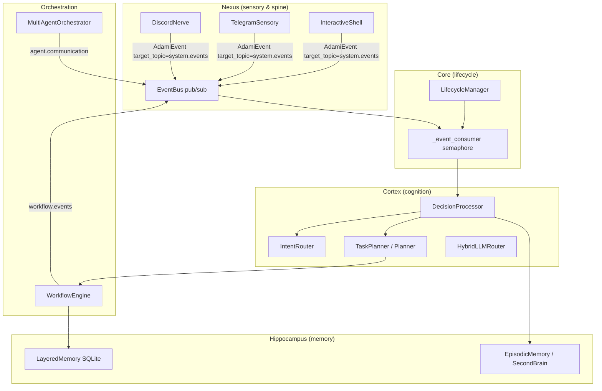
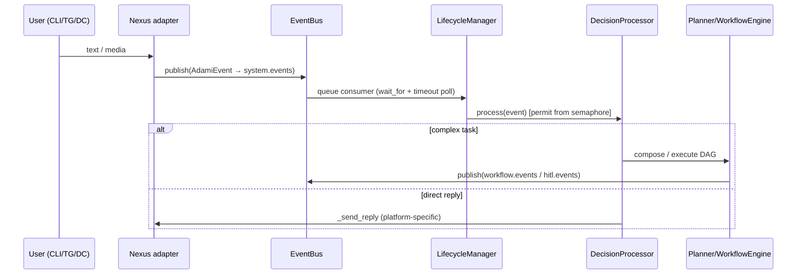

# AdamI Kernel — Architecture (technical deep dive)

**Audience**: principal engineers, security architects, acquirers doing technical diligence.

This document reflects the **current** layout under `src/adami_kernel/`. It is not a roadmap promise.

---

## 1. Layered topology

**Interpretation**

- **Nexus** owns the **event primitive** (`AdamiEvent`), **priorities**, and **topic routing**. External channels do not call the planner directly; they publish.
- **LifecycleManager** is the **sole long-running consumer** of `system.events` in the main loop, applying **bounded parallelism** (`asyncio.Semaphore`) before spawning `DecisionProcessor.process`.
- **Cortex** turns tasks into **intent tokens**, **tool calls**, or **planner-backed** workflows.
- **Orchestration** re-enters the bus on `workflow.events` / `agent.communication` / `hitl.events` depending on the scenario.
- **Hippocampus** provides **durable** workflow state and experience-like persistence (`hippocampus/README.md`).

### Knowledge wiki (SecondBrain)

Alongside SQLite workflow state in `LayeredMemory`, AdamI keeps a **PARA-shaped Markdown tree** on disk. `SecondBrainManager` (`hippocampus/second_brain.py`) resolves the tree root via `settings.path_second_brain_root`, overridable with **`ADAMI_SECOND_BRAIN_ROOT`**. `retrieve_brain_snippets` scores keywords against **top-level** `*.md` files in `Inbox/`, `Projects/`, and `Resources/` only—it is not whole-tree semantic search. For the accumulating-knowledge narrative aligned to code, read [knowledge_wiki_second_brain.md](knowledge_wiki_second_brain.md); Chinese mirror: [../zh/knowledge_wiki_second_brain.md](../zh/knowledge_wiki_second_brain.md).

### Profiles and shared SecondBrain

The **Orchestration** subgraph (`WorkflowEngine` + `MultiAgentOrchestrator` in the diagram above) owns **role- and workflow-scoped** state: `WorkflowState.context`, `workflow.events`, and `agent.communication`. That is separate from the **shared** on-disk SecondBrain tree under **`path_second_brain_root`**, where `Identity/*` and PARA notes remain visible across roles on the same kernel. Hermes-style “profiles” are mapped to conventions such as **`WorkflowState.metadata["profile_id"]`** (see SSOT doc). Full mapping: [profiles_shared_brain.md](profiles_shared_brain.md); Chinese: [../zh/profiles_shared_brain.md](../zh/profiles_shared_brain.md).

### Output examples

For **copy-paste golden paths** from kernel behavior to on-disk SecondBrain Markdown (intake + Report Studio, including **`/report run`** and `source="report_studio"`), see [output_examples_secondbrain_report.md](output_examples_secondbrain_report.md); Chinese mirror: [../zh/output_examples_secondbrain_report.md](../zh/output_examples_secondbrain_report.md).

---

## 2. Event flow (primary path)

---

## 3. Topics (non-exhaustive but contract-relevant)

| Topic | Typical publishers | Typical consumers |
|-------|--------------------|-------------------|
| `system.events` | `shell`, `TelegramSensory`, `DiscordNerve`, reflexion/planner follow-ups | `LifecycleManager._event_consumer` |
| `workflow.events` | `WorkflowEngine`, long-task gates | `WorkflowEngine` internal subscriber |
| `hitl.events` | HITL resume paths | `HitlHandler` |
| `agent.communication` | `MultiAgentOrchestrator` | same module subscriber loop |

Exact payload keys vary by adapter; see `API_REFERENCE.md`.

---

## 4. Mathematical model (design metaphor)

Let \(E_{\text{success},i}\) be indicator of successful handling of event \(i\), \(E_{\text{total},i}\equiv 1\), and \(\Delta\tau\) a decay term for stale retries / DLQ age. A **stability-oriented** kernel score can be stated as:

\[
S_{\text{kernel}} = \lim_{t \to \infty} \frac{\sum_{i=1}^{n} E_{\text{success},i}}{\sum_{i=1}^{n} E_{\text{total},i}} \cdot e^{-\Delta \tau}
\]

**Reading**: AdamI improves \(S_{\text{kernel}}\) by (a) bounding concurrent decision work, (b) persisting workflow state to recover from partial failures, and (c) isolating risky execution in audited loaders and optional Docker-backed sandboxes — so the numerator grows relative to uncontrolled agent loops.

This formula is a **communication device** for architecture reviews; empirical estimation must be defined per deployment (tracing, DLQ rates, replay tests).

---

## 5. Cross-cutting concerns

- **Observability**: OpenTelemetry bootstrap in `kernel.py` (exporter defaults are console-oriented; change for prod).
- **i18n**: shipped catalogs under `i18n/locales/{en,zh-Hans}/common.json` with parity tests (`tests/test_i18n_locale_key_parity.py`).
- **Training (optional)**: `poetry` extra `training` + scheduled loop when enabled in settings.

---

## 6. Related reading

- `src/adami_kernel/nexus/README.md`
- `src/adami_kernel/cortex/README.md`
- `src/adami_kernel/hippocampus/README.md`
- `docs/deer_flow_alignment_and_boundary.md` (Module 4 boundary)
- `docs/i18n_boundary_and_locale_policy.md` (Module 6)
