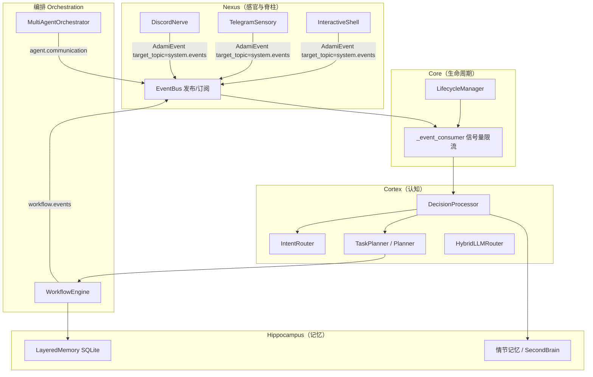
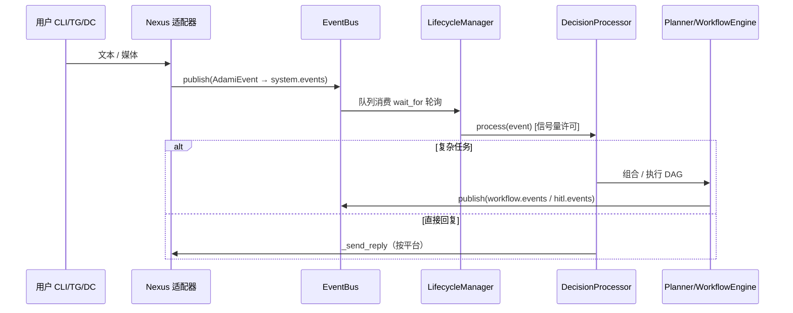

# AdamI Kernel — 架构说明（技术深度）

**读者**：首席架构师、资深开发、并购侧技术尽调。

本文描述 **当前** `src/adami_kernel/` 代码结构，不构成对未来路线图的法律承诺。

---

## 1. 分层拓扑

**解读**

- **Nexus** 持有 **事件原语**（`AdamiEvent`）、**优先级**与 **Topic 路由**；外部通道不直连 Planner，而是发布事件。
- **LifecycleManager** 在主循环中作为 `system.events` 的 **长期消费者**，在拉起 `DecisionProcessor.process` 前使用 **有界并发**（`asyncio.Semaphore`）。
- **Cortex** 将任务映射为 **意图令牌**、**工具调用** 或 **Planner 背书的** 工作流。
- **编排层** 在 `workflow.events` / `agent.communication` / `hitl.events` 等 Topic 上再次进入总线。
- **Hippocampus** 提供 **可持久化** 的工作流状态与类经验追加存储（见 `hippocampus/README.md`）。

### Knowledge wiki（SecondBrain）

除 `LayeredMemory` 内 SQLite 工作流状态外，AdamI 在磁盘上维护 **PARA 形 Markdown 树**。`SecondBrainManager`（`hippocampus/second_brain.py`）通过 `settings.path_second_brain_root` 解析根目录，可用 **`ADAMI_SECOND_BRAIN_ROOT`** 覆盖。`retrieve_brain_snippets` 仅在 **`Inbox/`**、**`Projects/`**、**`Resources/`** 下**一层** `*.md` 上做关键词匹配，不等价于整库语义 Wiki。与代码对齐的完整叙事见 [knowledge_wiki_second_brain.md](knowledge_wiki_second_brain.md)；英文版：[../en/knowledge_wiki_second_brain.md](../en/knowledge_wiki_second_brain.md)。

### Profiles and shared SecondBrain（多角色与共享第二大脑）

上图 **编排 Orchestration** 子图（`WorkflowEngine` + `MultiAgentOrchestrator`）承载 **按工作流、按角色隔离** 的状态：`WorkflowState.context`、`workflow.events`、`agent.communication`。这与 **共享** 的 SecondBrain 磁盘树（**`path_second_brain_root`** 下 `Identity/*` 与 PARA 笔记）不同——同一 kernel 上各角色仍读同一套落盘身份与知识。Hermes 式「profile」在 AdamI 中可映射到 **`WorkflowState.metadata["profile_id"]`** 等约定，详见 SSOT：[profiles_shared_brain.md](profiles_shared_brain.md)；英文版：[../en/profiles_shared_brain.md](../en/profiles_shared_brain.md)。

### 输出范例（Output examples）

从内核行为到 SecondBrain 落盘 Markdown（含 intake、Report Studio、**`/report run`** 与 `source="report_studio"`）的逐步范例见 [output_examples_secondbrain_report.md](output_examples_secondbrain_report.md)；英文版：[../en/output_examples_secondbrain_report.md](../en/output_examples_secondbrain_report.md)。

---

## 2. 主事件流（时序）

---

## 3. Topic 清单（非穷尽，但具契约意义）

| Topic | 典型发布方 | 典型消费方 |
|-------|------------|------------|
| `system.events` | `shell`、`TelegramSensory`、`DiscordNerve`、反思/Planner 后续 | `LifecycleManager._event_consumer` |
| `workflow.events` | `WorkflowEngine`、长任务门控 | `WorkflowEngine` 内部订阅 |
| `hitl.events` | HITL 恢复路径 | `HitlHandler` |
| `agent.communication` | `MultiAgentOrchestrator` | 同模块订阅循环 |

载荷字段随适配器变化，详见 [API_REFERENCE.md](API_REFERENCE.md)。

---

## 4. 数学模型（设计隐喻）

设 \(E_{\text{success},i}\) 为第 \(i\) 个事件成功处理的示性变量，\(E_{\text{total},i}\equiv 1\)，\(\Delta\tau\) 表示重试/DLQ 老化等衰减项，则 **稳定性导向** 的内核评分可写为：

\[
S_{\text{kernel}} = \lim_{t \to \infty} \frac{\sum_{i=1}^{n} E_{\text{success},i}}{\sum_{i=1}^{n} E_{\text{total},i}} \cdot e^{-\Delta \tau}
\]

**含义**：AdamI 通过（a）限制并发决策、（b）持久化工作流状态以从部分失败恢复、（c）在经审计的加载器与可选 Docker 沙箱中隔离高风险执行，使分子相对「不受控 Agent 循环」增大。

该式用于 **架构评审沟通**；若需经验估值，须在具体部署上定义追踪指标、DLQ 率与回放测试结果。

---

## 5. 横切能力

- **可观测性**：`kernel.py` 中 OpenTelemetry 引导（默认控制台导出器；生产需替换）。
- **i18n**：`i18n/locales/{en,zh-Hans}/common.json`，键级 parity 测试 `tests/test_i18n_locale_key_parity.py`。
- **训练（可选）**：`poetry` extra `training` + 配置启用时的定时循环。

---

## 6. 延伸阅读

- `src/adami_kernel/nexus/README.md`
- `src/adami_kernel/cortex/README.md`
- `src/adami_kernel/hippocampus/README.md`
- `docs/deer_flow_alignment_and_boundary.md`
- `docs/i18n_boundary_and_locale_policy.md`
